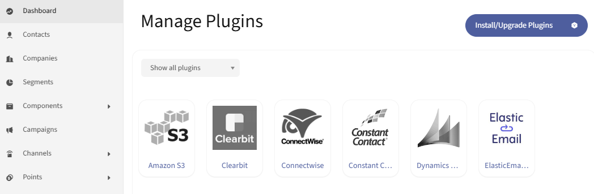
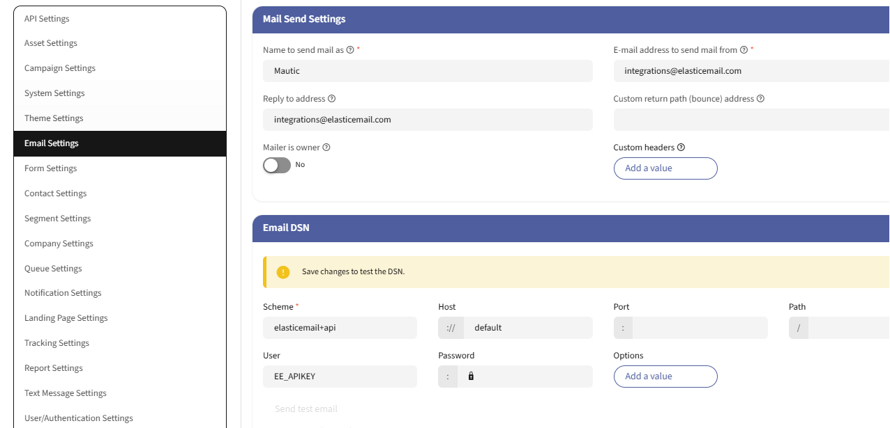

# ElasticEmail Mailer Mautic Plugin Installation Guide

## Requirements
- Mautic 5.x (minimum 5.1)
- PHP 8.0 or higher

## Installation Steps

1. **Download the Plugin**
    - Download the plugin package from Github repository or by using Composer.

2. **Clear Mautic cache**
    - Clear the Mautic cache to ensure the plugin is loaded correctly.
    - You can do this by running the following command in your Mautic root directory:
     ```sh
     php bin/console cache:clear
     ```

3. **Verify Installation**
    - The plugin should appear on the list of available plugins.

    

4. **Configure the Plugin**
    - Once installed, navigate to `Configuration` > `Email settings`.
    - Under section `Email DSN` enter the following values:
        - Scheme: `elasticemail+api`
        - Host: `default`
        - User: `your ElasticEmail API Key`
    - Test settings by clicking `Send test email`

    

## Troubleshooting
- If you encounter any issues, check the Mautic logs located in the `var/logs` directory.
- Ensure that all requirements are met and that there are no conflicts with other plugins.

For more detailed instructions, refer to the official documentation or support resources.