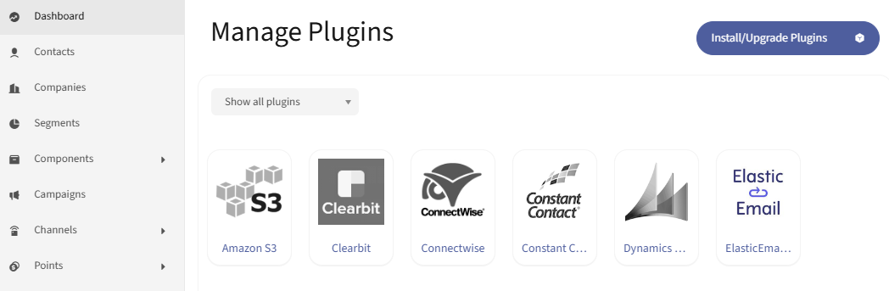
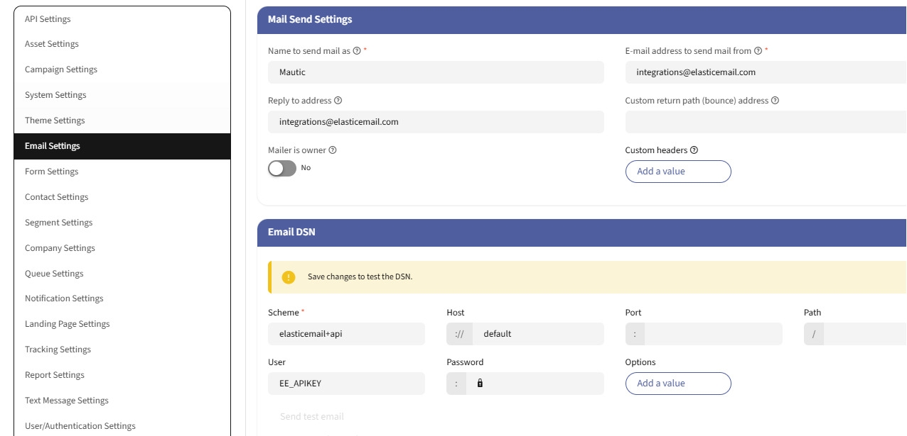

<div align="center">


# Elastic Email Mailer for Mautic

The official [Mautic](https://mautic.org) plugin for sending email through [Elastic Email](https://elasticemail.com), over the REST API v4 or SMTP.

[](https://github.com/ElasticEmail/elasticemail-mautic-mailer/releases/latest)
[](https://github.com/ElasticEmail/elasticemail-mautic-mailer/releases)
[](https://mautic.org)
[](https://www.php.net/supported-versions.php)
[](https://elasticemail.com/developers/api-documentation/rest-api)
[](LICENSE)

[](https://github.com/ElasticEmail/elasticemail-mautic-mailer/commits/main)
[](https://github.com/ElasticEmail/elasticemail-mautic-mailer/issues)
[](https://github.com/ElasticEmail/elasticemail-mautic-mailer/stargazers)

[Installation](#installation) •
[Configuration](#configuration) •
[Troubleshooting](#troubleshooting) •
[Examples](#more-examples) •
[Contributing](#contributing)

</div>

---

## Features

- **Drop-in Mautic mailer.** Registers a Symfony Mailer transport, so campaigns, segment emails, transactional emails and test emails all go through Elastic Email.
- **HTTP API transport.** Sends through the Elastic Email REST API v4 (`/emails/transactional`) with your API key.
- **SMTP transport.** Or send through `smtp.elasticemail.com` with SMTP credentials.
- **Full message support.** HTML and plain-text bodies, CC and BCC, Reply-To, attachments and custom headers.
- **Message tracking.** The Elastic Email `MessageID` is stored on each sent message.
- **Built on the official SDK.** Uses the [Elastic Email PHP SDK](https://github.com/ElasticEmail/elasticemail-php) to build API requests.

## Requirements

| Component | Version |
| --- | --- |
| Mautic | 5.1 or later, 6.x and 7.x |
| PHP | 8.1 or later (8.2 or later for Mautic 7) |
| Symfony Mailer / HTTP Client | 5.4, 6.x or 7.x (bundled with Mautic) |
| [`elasticemail/elasticemail-php`](https://packagist.org/packages/elasticemail/elasticemail-php) | 4.0.20 or later |

You'll also need an Elastic Email **API key** with permission to send email. You can create one in your [API settings](https://app.elasticemail.com/marketing/settings/new/manage-api). For the SMTP transport, create SMTP credentials in the same settings area instead.

## Installation

### 1. Download the plugin

Download **`ElasticEmailMailerBundle.zip`** from the [latest release](https://github.com/ElasticEmail/elasticemail-mautic-mailer/releases/latest) and extract it into your Mautic plugins directory. Where that is depends on how Mautic was installed:

| Installation | Plugins directory |
| --- | --- |
| Composer (`mautic/recommended-project`) or the official Docker image, the default for Mautic 6 and 7 | `docroot/plugins/` |
| Downloaded Mautic zip (older installs) | `plugins/` |

```bash
cd /path/to/mautic
curl -L -o /tmp/ElasticEmailMailerBundle.zip \
  https://github.com/ElasticEmail/elasticemail-mautic-mailer/releases/latest/download/ElasticEmailMailerBundle.zip

# Composer or Docker install (Mautic 6 and 7)
unzip /tmp/ElasticEmailMailerBundle.zip -d docroot/plugins/

# Zip install: use plugins/ instead
# unzip /tmp/ElasticEmailMailerBundle.zip -d plugins/
```

> [!IMPORTANT]
> The plugin directory must be named exactly **`ElasticEmailMailerBundle`**, for example `docroot/plugins/ElasticEmailMailerBundle`. If you use GitHub's "Source code" archive instead of the release zip, rename the extracted folder, or Mautic won't load the bundle.

### 2. Install the Elastic Email PHP SDK

From the Mautic root directory:

```bash
composer require elasticemail/elasticemail-php
```

### 3. Clear the cache and reload plugins

```bash
php bin/console cache:clear
php bin/console mautic:plugins:reload
```

### 4. Check that the plugin is installed

Open **Settings → Plugins**. **ElasticEmail Mailer plugin for Mautic** should be on the list.



## Configuration

Go to **Settings → Configuration → Email Settings** and fill in the **Email DSN** section.

### HTTP API (recommended)

| Field | Value |
| --- | --- |
| Scheme | `elasticemail+api` |
| Host | `default` |
| User | Your Elastic Email API key |
| Password | *(leave empty)* |

This is equivalent to the DSN:

```text
elasticemail+api://YOUR_API_KEY@default
```



Click **Send test email** to check the settings. The **From** address must use a domain you've verified in your Elastic Email account.

> [!TIP]
> Use a dedicated API key for Mautic with only the access it needs, so you can rotate or revoke it without affecting other apps.

### SMTP

| Field | Value |
| --- | --- |
| Scheme | `elasticemail+smtp` |
| Host | `default` |
| User | Your SMTP username |
| Password | Your SMTP password |

The transport connects to `smtp.elasticemail.com` on port `2525`.

### Supported schemes

| Scheme | Transport |
| --- | --- |
| `elasticemail+api` | HTTP API (REST API v4) |
| `elasticemail` | Alias for `elasticemail+api` |
| `elasticemail+smtp` | SMTP (`smtp.elasticemail.com:2525`) |

## Troubleshooting

- **The plugin doesn't appear in Mautic.** Check that the folder is `docroot/plugins/ElasticEmailMailerBundle` (Composer or Docker installs) or `plugins/ElasticEmailMailerBundle` (zip installs), then run `php bin/console cache:clear` and `php bin/console mautic:plugins:reload` again.
- **`Class "ElasticEmail\Api\EmailsApi" not found`.** The SDK isn't installed. Run `composer require elasticemail/elasticemail-php` in the Mautic root.
- **`The "elasticemail+api" scheme is not supported`.** The cache still holds the old container. Clear it and reload plugins.
- **Test email fails with code 401 or 403.** The API key is wrong or doesn't have permission to send email.
- **Sender address rejected.** Verify the From domain in your Elastic Email account.
- Anything else: check the Mautic logs in `var/logs/`.

## More examples

Looking to send from your own PHP or Symfony code instead of Mautic? Runnable samples are in the **[Elastic Email examples repository](https://github.com/ElasticEmail/elasticemail-examples)**:

- 🐘 [PHP and Symfony examples](https://github.com/ElasticEmail/elasticemail-examples/tree/main/php-elasticemail-examples)
- ✉️ [SMTP examples](https://github.com/ElasticEmail/elasticemail-examples/tree/main/smtp-elasticemail-examples)
- 📂 [All examples](https://github.com/ElasticEmail/elasticemail-examples)

## API limits

- Up to **20 concurrent connections** per account
- A hard timeout of **600 seconds** per request

## Versioning

Releases follow [Semantic Versioning](https://semver.org). See [Releases](https://github.com/ElasticEmail/elasticemail-mautic-mailer/releases) for the changelog and the plugin zip for each version.

<details>
<summary><strong>Plugin details</strong></summary>

| | |
| --- | --- |
| Composer package | `elasticemail/elasticemail-mautic-mailer` (type `mautic-plugin`) |
| Bundle | `MauticPlugin\ElasticEmailMailerBundle\ElasticEmailMailerBundle` |
| Install directory | `docroot/plugins/ElasticEmailMailerBundle` (Composer or Docker) or `plugins/ElasticEmailMailerBundle` (zip install) |
| Transport factory | `Mailer/Factory/ElasticEmailTransportFactory.php` |
| Transports | `Mailer/Transport/ElasticEmailApiTransport.php`, `Mailer/Transport/ElasticEmailSmtpTransport.php` |

</details>

## Contributing

Contributions are welcome! Please read [CONTRIBUTING.md](CONTRIBUTING.md) before opening a pull request.

- 🐛 [Report a bug](https://github.com/ElasticEmail/elasticemail-mautic-mailer/issues/new?template=bug_report.md)
- 💡 [Request a feature](https://github.com/ElasticEmail/elasticemail-mautic-mailer/issues/new?template=feature_request.md)
- 🔒 [Report a security issue](SECURITY.md)

This project follows the [Contributor Covenant Code of Conduct](CODE_OF_CONDUCT.md).

## Support

> [!IMPORTANT]
> The fastest way to get help is the **chat widget on [elasticemail.com](https://elasticemail.com)**. Our support team can help with your account, sending, deliverability and API questions.

- 💬 [Chat with support on elasticemail.com](https://elasticemail.com) (preferred)
- 📚 [API documentation](https://elasticemail.com/developers/api-documentation/rest-api)
- 🧪 [Examples repository](https://github.com/ElasticEmail/elasticemail-examples)
- 🐛 [GitHub issues](https://github.com/ElasticEmail/elasticemail-mautic-mailer/issues), for bugs in this plugin only

## License

Released under the [MIT License](LICENSE). Copyright © 2021–2026 Elastic Email.
